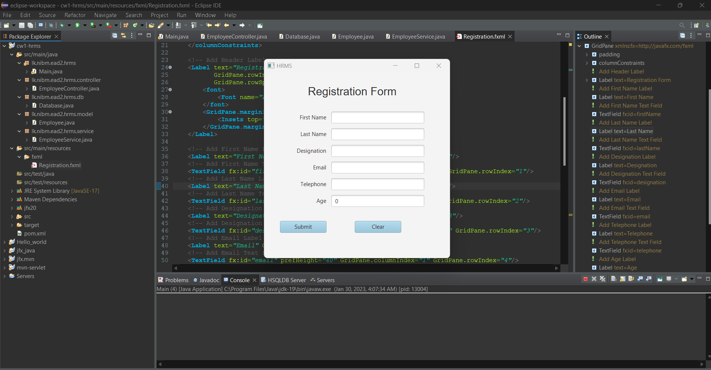

# JavaFx-Employee-Registration-form

# Configure HSQLDB Plugin

1. Go to Eclipse -> Help -> Eclipse Marketplace
2. In the search field type HSQLDB and start search
3. Select HSQLDB Database server plugin and install it
4. Once the installation is completed navigate to Window -> Show View  -> Other
5. Filter by HSQLDB and open HSQLDB server console
6. In the HSQLDB server console click on the Kebab menu in the toolbar then go to  preferences
7. In preference add file store name (ex: db) . Set the database name as HRMS. Username should be sa and keep password empty.Click on Apply and Close
Finally start the server.
8. Go to the console tab and you can see database server is started with the database HRMS.
9. Again navigate to HSQLDB server console - > Kebab menu -> Show database client
10. In the HSQLDB database manager enter the sql script given and create the table.

# Create a database called HRMS and add an employee table

CREATE TABLE Employee (
ID INTEGER IDENTITY PRIMARY KEY,
FirstName VARCHAR(255) NOT NULL,
LastName VARCHAR(255) NOT NULL,
Designation VARCHAR(100) NOT NULL,
Email VARCHAR(50),
Telephone VARCHAR(20),
Age INTEGER );

